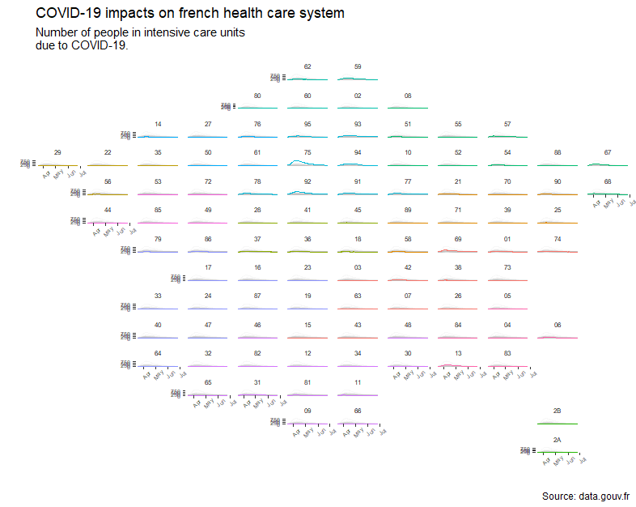
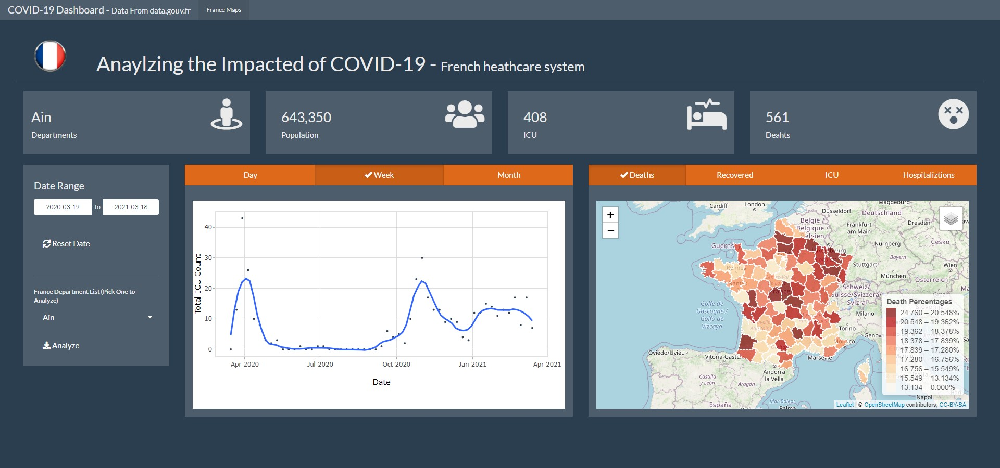

# France COVID-19 Analysis


---


### Table of Contents
- [Description](#description)
- [Cédric Batailler Code](#TidyTuesday)
- [Technologies](#Tech)
- [How To Use](#how-to-use)
- [Installation](#Installation)
- [References](#references)
- [Author Info](#author-info)

---


## Description

This is my first R Shiny application. My inspiration for this project came from a TidyTuesday post by Cédric Batailler. His visualization on the impact of the French health care system was very impactful. His visualization consists of time trends of French departments, and the total number of intensive care unit patients (ICU patients) from  March to June do to COVID-19. Cédric graph is laid out in a format that mimics the shape of France by department. His visualization shows that Paris by far got hit the hardest do to COVID-19. Furthermore, department surrounding Paris also were affected tremendously by COVID-19, creating this centralize hotspot around Paris. I believe this visualization shows the affect of COVID-19 very well, but for someone that has specialized skills. This is were the inspiration for my project comes in. My goal was to take this visualization, and make it more useable and understandable for the not so tech savvy individuals. I tried to achieve this by building an interactive R Shiny application. In the "How to use" section I will go more into detail on how the application functions.


* The ShinyApp.io link is at the bottom of the page in the Author info!
   HAVE FUN!

---


## Cédric Batailler Code

```R
### TidyTuesday

# Packages used for analysis
library(tidyverse)
library(geofacet)
library(googlesheets4)
library(gghighlight)


# allow you to import the code from the data sources
covid_department_dataset <-
    readr::read_csv2("https://www.data.gouv.fr/fr/datasets/r/63352e38-d353-4b54-bfd1-f1b3ee1cabd7")


# Getting France departments which are countries in France
departments <-
    sheets_read("1hKY0kjzLm55q1R2jD7FmbRkC6XTb0El4oEbVvi98pwo",
                sheet = "departement")


regions <-
    sheets_read("1hKY0kjzLm55q1R2jD7FmbRkC6XTb0El4oEbVvi98pwo",
                sheet = "region")


covid_department_dataset <- covid_department_dataset %>%
    semi_join(departments,
              by = c("dep" = "code")) %>%
    left_join(regions,
              by = c("dep" = "code")) %>%
    filter(sexe == 0) # Because we don't want to make gender-based
# analysis, we keep the overall results


 covid_department_dataset %>%

    ggplot(aes(y = rea,
               x = jour,
               color = region,
               group = dep)) +
    geom_line() +
    gghighlight(unhighlighted_params = list(alpha = 0.1)) +
    facet_geo(~ dep,
              grid = departments) +
    labs (x = "",
          y = "",
          title = "COVID-19 impacts on french health care system",
          subtitle = "Number of people in intensive care units\ndue to COVID-19.",
          caption = "Source: data.gouv.fr") +
    theme(text = element_text("Atlas Grotesk"),
          plot.caption = element_text("Atlas Grotesk"),
          strip.background = element_blank(),
          panel.background = element_blank(),
          strip.text = element_text(family = "Atlas Grotesk",
                                    size   = 6),
          axis.text = element_text(family = "Atlas Grotesk",
                                   size   = 5),
          axis.text.x = element_text(angle = 45),
    )
```


---


#### Cédric visualization



#### Warning!!!
- To read in the data from the google sheets you may need to give googlesheets4 access to a Google account. You will also need to allow Tidyverse API access as well. When you loading the departments or regions datasets for the first time you may be ask to authorize an account an enter zero to obtain a new token or Esc/Ctrl + C to abort.

- The covid_department_dataset is updated each day by the French organization that handles the data. Watch out for how the new data is read into R. There may be parsing failures that may affect the shiny app.

-  If you run the app with the data imported from www.data.gouv.fr, you will get the most updated data on covid-19 in France. However, you will run the risk of the data not being imported accurately for the shiny app. So far, I've only have had issues with the (jour/date column). To solve this issue, I saved a .CSV file of the data from months 2020-03-18 to 2020-06-30. (covid_department_dataset.csv) This data frame will work in the shiny app.
---


## Technologies

- R: is an open sours free software for statistical computing and visualizations

- RStudio: Is an IDE for R. I makes coding in R much more enjoyable (Highly recommended)

- R Packages: Some R packages pre installed, but many that are used for this project must be installed before code is executed. Some of these packages are:
  - A.) interactive Packages
    - 1.) flexdashboard   --------> Creates the dashboard layout
    - 2.) shiny           --------> Helps give functionality
    - 3.) shinyWidgets    --------> Widgets for the app
    - 4.) shinyjs         --------> Helps with play and reset buttons
  - B.) Core Packages
      - 1.) Tidyverse     ---------> A collection of packages for data                           
      - 2.) lubridate     ---------> For date data type columns
      - 3.) googlesheets4 ---------> Reading in data from google sheet
      - 4.) geofacet      ---------> For Cédric visualization
      - 5.) gghighlight   ---------> For Cédric visualization
  - C.) visualization Package
      - 1.) plotly        ---------> To make plots interactive
      - 2.) maps          ---------> Get geo-location values     
---


## How To Use
The app is very intuitive. The app give many different options to viewing and analyzing the data.  In the sidebar of the app you will have the ability to change the time periods, and to select a specific French department to analyze. All this can be done with a simple click of a button.

#### My Shinny app



---


## Installation
- [How to Install R/RStudio](https://www.youtube.com/watch?v=9-RrkJQQYqY)
- [How to Install Packages in RStudio](https://www.youtube.com/watch?v=u1r5XTqrCTQ)

#### Helpful Tips and Tricks
- [Useful R Packages](https://support.rstudio.com/hc/en-us/articles/201057987-Quick-list-of-useful-R-packages)
- [Font Awesome for Shiny icons](https://fontawesome.com/)
- [Shiny Widgets](https://shiny.rstudio.com/gallery/widget-gallery.html)
- [Shiny App Examples](https://shiny.rstudio.com/)
- [Shiny Function Reference](https://shiny.rstudio.com/reference/shiny/1.0.5/)
---

## References

#### Cédric Batailler Info
- [Cédric Batailler Webpage](https://cedricbatailler.me/post/2020-covid-map)
- [Cédric Batailler TidyTuesday Twitter Post](https://twitter.com/cedricbatailler/status/1260465718069510144)
- [French Government Webpage (data.gouv.fr)](https://www.data.gouv.fr/fr/)

---

## Author info
- [My Linkedin Page](https://www.linkedin.com/in/samuel-bacon-49285316a/)
- [My ShinyApp.io]( https://sam-bacon-shinyapps.shinyapps.io/France_COVID-19/)
---
